<div align="center">

**Language:** **English** · [Русский](README.ru.md)

# Faber Companii — Web

**Frontend for a multi-tenant B2B/B2C platform for service companies**

React 19 · Vite 7 · TanStack Query · Zustand · Tailwind CSS 4

[](https://react.dev)
[](https://vitejs.dev)
[](https://typescriptlang.org)
[](https://tailwindcss.com)

[Quick start](#quick-start) · [Architecture](#architecture) · [Routing](#routing) · [Roles](#roles-and-user-flows) · [API integration](#api-integration)

</div>

---

## What is this project?

**companii-web** is the client application for **Faber Companii**: a public marketing site, company catalog, three isolated cabinets, and a unified auth system.

| App zone | URL | Who uses it |
|----------|-----|-------------|
| **Public site** | `/{locale}/...` | All visitors |
| **Company cabinet** | `/company/*` | `COMPANY_STAFF` |
| **Client portal** | `/portal/*` | `END_CLIENT` |
| **Platform admin** | `/admin/*` | `PLATFORM_ADMIN` |

Backend: **[companii-api](../companii-api)** — NestJS + PostgreSQL RLS.

---

## System overview

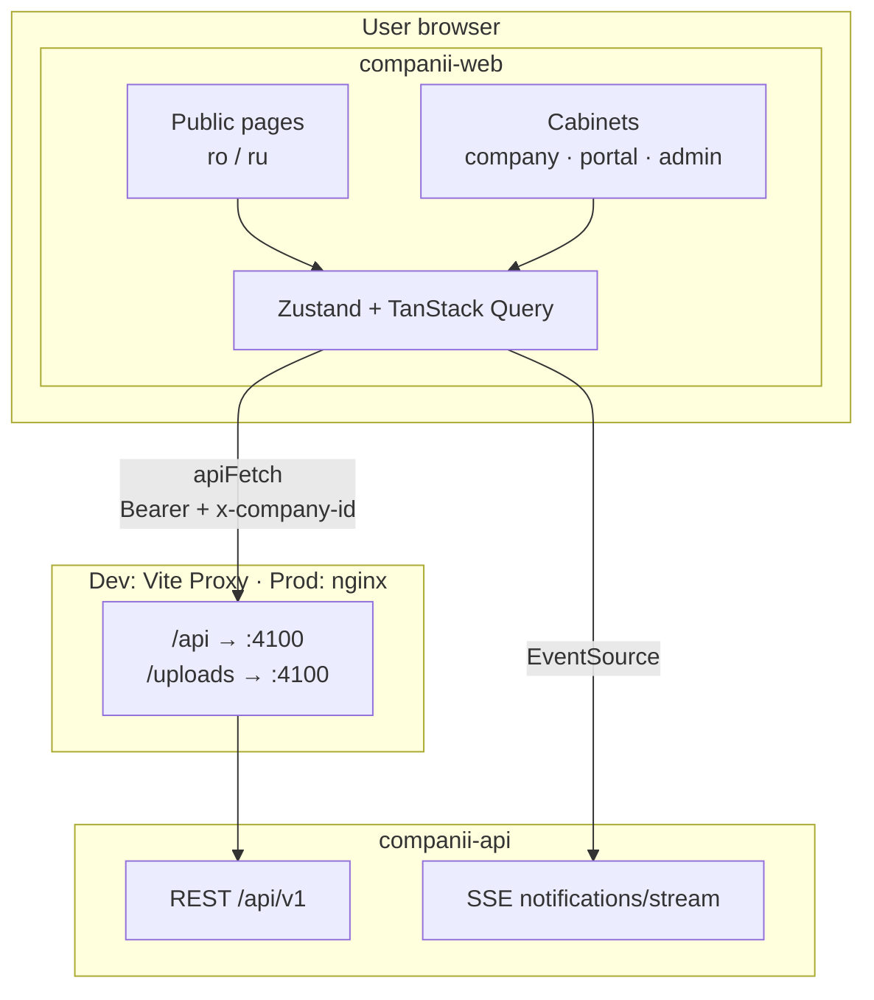

---

## Architecture

The project follows **Feature-Sliced Design (FSD)** — code is split by responsibility layer, with business logic in `features/`.

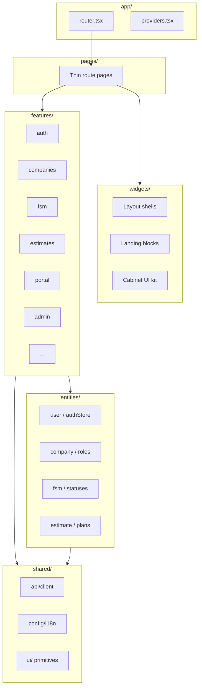

### State management

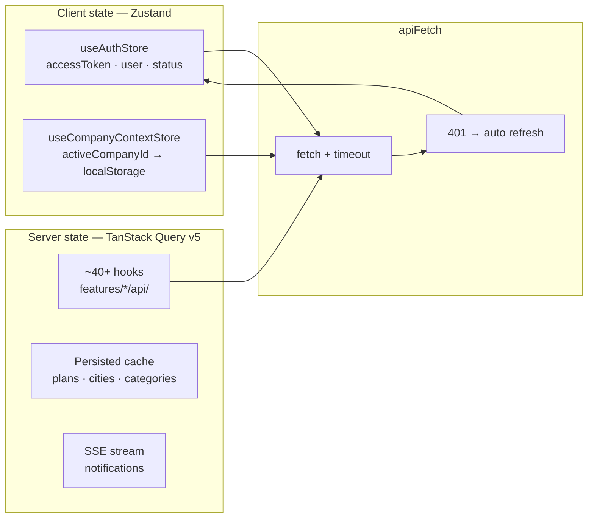

| Tool | File | Purpose |
|------|------|---------|
| **Zustand** | `src/entities/user/model/authStore.ts` | Token, user, login/logout |
| **Zustand** | `src/entities/company/model/companyContextStore.ts` | Active company (persisted) |
| **TanStack Query** | `src/shared/api/queryClient.ts` | API cache, staleTime 5 min |
| **Persist** | `src/shared/api/persistQuery.ts` | IndexedDB for reference data |

> **Redux is not used** — Zustand for UI/auth, TanStack Query for all server state.

---

## Feature modules

10 business modules in `src/features/`:

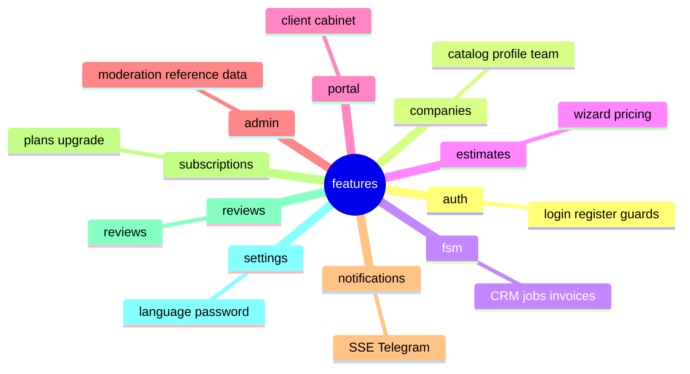

| Module | API hooks | UI |
|--------|-----------|-----|
| **auth** | `useAuth.ts` | login/register forms, `AuthBootstrap` |
| **companies** | `useCompaniesPublic`, `useCompaniesTeam` | profile, gallery, catalog |
| **fsm** | `useCustomers`, `useLeads`, `useInterventions`, `useQuotes`, `useInvoices` | CRM, Kanban, calendar, analytics |
| **estimates** | `useEstimateProjects`, `useEstimateActions` | 5-step wizard, worksheets |
| **portal** | `usePortal.ts` | requests, estimates, invoices sections |
| **admin** | `useAdminCompanies`, `useAdminStats` | moderation, blueprints |
| **notifications** | `api.ts` + SSE | `NotificationBell` |
| **subscriptions** | plans API | `PlanCards`, `PlanUpgradePanel` |

---

## Routing

Configuration: `src/app/routes/router.tsx`  
Constants: `src/shared/constants/routes.constants.ts`

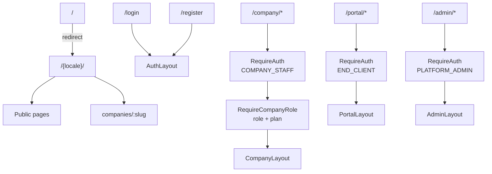

### Public pages (`/{locale}/...`)

| Path | Page |
|------|------|
| `/` | Landing |
| `how-it-works` | How it works |
| `faq` | FAQ |
| `preturi` | Pricing |
| `companies` | Company catalog |
| `companies/:slug` | Company profile + request form |
| `privacy`, `terms` | Legal pages |

**Locales:** `ro` (default) and `ru` — URL prefix.

### Company cabinet (`/company/*`)

| Path | Section | Min. role / plan |
|------|---------|------------------|
| `/company` | Dashboard + analytics | MEMBER |
| `/company/profile` | Company profile | OWNER |
| `/company/clienti` | CRM customers | MANAGER · PRO |
| `/company/cereri` | Leads | MANAGER · PRO |
| `/company/pipeline` | Kanban | MANAGER · BUSINESS |
| `/company/lucrari` | Jobs | MEMBER |
| `/company/calendar` | Calendar | MEMBER |
| `/company/smete` | Estimates | MANAGER · BUSINESS |
| `/company/oferte` | Quotes | MANAGER · BUSINESS |
| `/company/facturi` | Invoices | MANAGER · BUSINESS |
| `/company/team` | Team | OWNER |
| `/company/subscription` | Plan | OWNER |
| `/company/audit` | Audit log | OWNER |

### Client portal (`/portal/*`)

| Path | Section |
|------|---------|
| `/portal` | Dashboard |
| `/portal/cereri` | My requests |
| `/portal/lucrari` | Jobs |
| `/portal/oferte` | Quotes (accept/decline) |
| `/portal/smete` | Estimates |
| `/portal/facturi` | Invoices + payment proof |

### Admin (`/admin/*`)

| Path | Section |
|------|---------|
| `/admin` | Statistics + moderation |
| `/admin/companies` | Companies |
| `/admin/cities` | Cities |
| `/admin/categories` | Categories |
| `/admin/blueprints` | Estimate blueprints |
| `/admin/waitlist` | Waitlist |
| `/admin/audit` | Platform audit |

Pages are **lazy-loaded** via `src/app/routes/lazy-pages/`.

---

## Roles and user flows

### Three account types

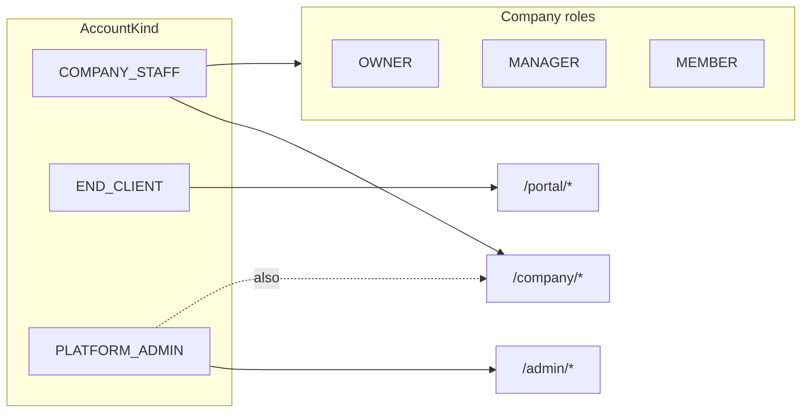

### Flow: from request to payment

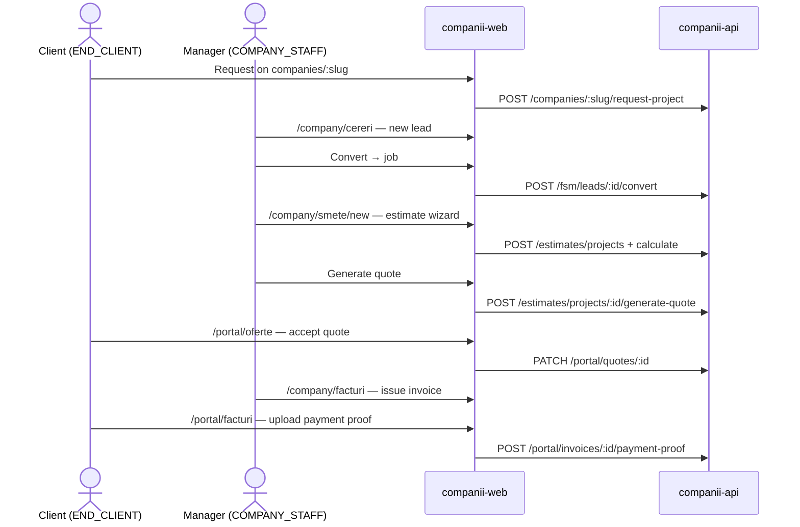

### Estimate wizard (5 steps)

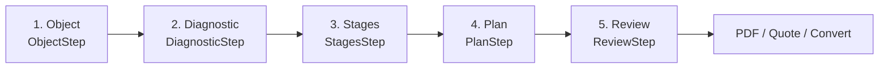

Files: `src/features/estimates/wizard/steps/`

---

## API integration

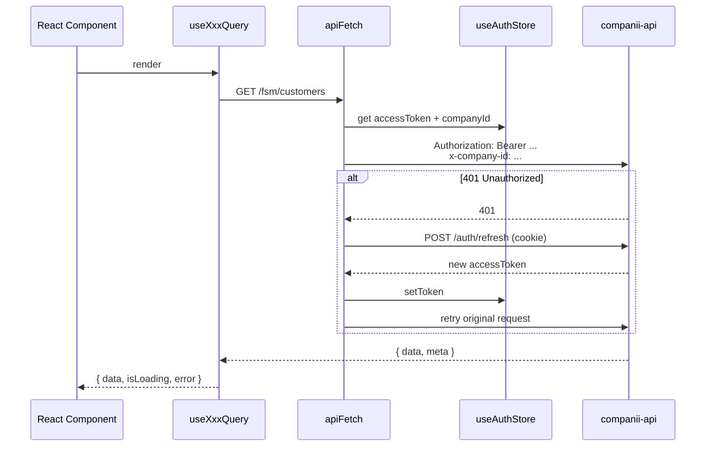

| File | Purpose |
|------|---------|
| `src/shared/api/client/apiFetch.ts` | Main fetch wrapper |
| `src/shared/api/client/config.ts` | Auth context + refresh |
| `src/entities/user/api/refreshAccessToken.ts` | Token refresh |
| `src/entities/user/api/authContext.ts` | Bearer + x-company-id |
| `src/shared/config/env.ts` | `VITE_API_URL`, httpOnly cookie |

**Dev proxy** (`vite.config.ts`): `/api` and `/uploads` → `http://127.0.0.1:4100`  
**Prod** (`nginx.conf`): SPA fallback + proxy `/api/` → `http://api:4100/api/`

---

## UI and design system

| Technology | Usage |
|------------|-------|
| **Tailwind CSS 4** | `@theme` in `src/index.css`, violet/indigo palette |
| **Radix UI** | Label, Slot |
| **TanStack Table** | CRM and invoice tables |
| **ApexCharts** | Dashboard analytics (lazy) |
| **react-hot-toast** | Toasts |
| **react-helmet-async** | SEO meta tags |

Cabinet UI kit: `src/widgets/cabinet/cabinet-ui.tsx` — `Panel`, `PageHero`, `SoftBadge`, glass-panel styles.

---

## Internationalization (i18n)

| Parameter | Value |
|-----------|-------|
| Library | i18next + react-i18next |
| Languages | `ro` (fallback), `ru` |
| Public URLs | `/{locale}/...` |
| Cabinets | Language from localStorage / i18next |
| Lazy load | Only active language in initial bundle |

```
src/shared/config/i18n/translations/
├── companii/ru|ro/     # cabinet, auth, admin, portal
├── public/ru|ro/       # landing, marketing
└── status.ru|ro.ts     # FSM statuses
```

---

## Plan entitlements

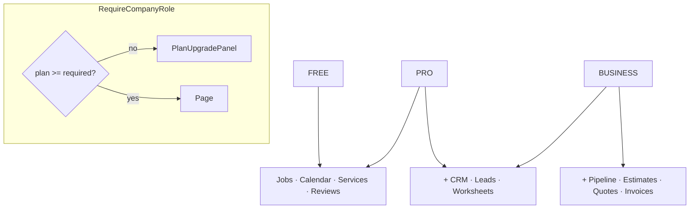

File: `src/entities/subscription/model/planEntitlements.ts`

---

## Quick start

### Local development

```bash
# 1. Start the API (sibling repo)
cd ../companii-api
docker compose -f docker-compose.dev.yml up -d postgres redis
npm run start:dev

# 2. Start the frontend
cd ../companii-web
cp .env.example .env
npm install
npm run dev
```

| Service | URL |
|---------|-----|
| App | http://localhost:5174 |
| API (via proxy) | http://localhost:5174/api/v1 |

### Docker

```bash
cp .env.docker.example .env.docker
npm run docker:up:build        # dev, port 5174
```

---

## Environment variables

| Variable | Description | Default |
|----------|-------------|---------|
| `VITE_API_URL` | API base URL | `/api/v1` |
| `VITE_DEV_API_PROXY_TARGET` | Vite proxy target | `http://127.0.0.1:4100` |
| `VITE_ENV` | Environment | `development` |
| `VITE_USE_HTTPONLY_COOKIE` | Refresh in cookie | `true` |
| `VITE_MEDIA_URL` | CDN for media (optional) | — |

Production build args: `VITE_API_URL=https://api.companii.faber.md/api/v1`

---

## Repository structure

```
companii-web/
├── src/
│   ├── main.tsx
│   ├── app/
│   │   ├── providers.tsx       # Query, i18n, Motion
│   │   └── routes/             # router, lazy-pages, guards
│   ├── pages/                  # route pages
│   ├── widgets/
│   │   ├── layout/             # CompanyLayout, PortalLayout, AdminLayout
│   │   ├── landing/            # landing blocks
│   │   └── cabinet/            # cabinet UI kit
│   ├── features/               # 10 business modules
│   │   ├── auth/
│   │   ├── companies/
│   │   ├── fsm/
│   │   ├── estimates/          # largest module
│   │   ├── portal/
│   │   └── admin/
│   ├── entities/               # domain models + stores
│   │   ├── user/model/authStore.ts
│   │   ├── company/model/roles.constants.ts
│   │   └── subscription/model/planEntitlements.ts
│   └── shared/
│       ├── api/                # apiFetch, queryClient
│       ├── config/i18n/        # ro/ru translations
│       └── ui/                 # primitives
├── nginx.conf                  # prod: SPA + API proxy
├── docker-compose.dev.yml
├── docker-compose.prod.yml
└── Dockerfile                  # dev (Vite) + prod (nginx)
```

---

## Scripts

```bash
npm run dev              # Vite dev server :5174
npm run build            # tsc + vite build
npm run build:seo        # build + sitemap
npm run build:analyze    # bundle visualizer
npm run test             # Vitest
npm run lint             # ESLint
```

---

## Real-time notifications

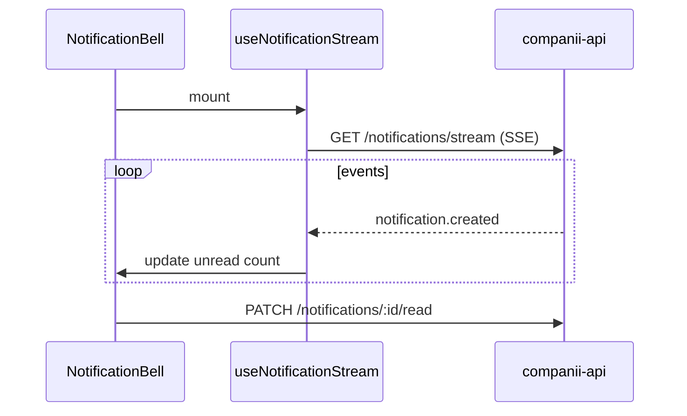

Files: `src/features/notifications/hooks/useNotificationStream.ts`

---

## Backend integration

| Aspect | Web | API |
|--------|-----|-----|
| Auth | Zustand + httpOnly cookie | JWT + refresh rotation |
| Tenant | `x-company-id` header | PostgreSQL RLS |
| Cache | TanStack Query + IndexedDB | Redis cache |
| Files | `MediaImage`, lightbox | B2 / local uploads |
| PDF | download blob | BullMQ pdf workers |

Backend: **[companii-api](../companii-api)**

---

<div align="center">

**Faber Companii Web** · React 19 · Private

</div>
