<div align="center">

**Language:** [English](README.md) · **Русский**

# Faber Companii — Web

**Фронтенд мультитенантной B2B/B2C платформы для сервисных компаний**

React 19 · Vite 7 · TanStack Query · Zustand · Tailwind CSS 4

[](https://react.dev)
[](https://vitejs.dev)
[](https://typescriptlang.org)
[](https://tailwindcss.com)

[Быстрый старт](#-быстрый-старт) · [Архитектура](#-архитектура) · [Маршруты](#-маршрутизация) · [Роли](#-роли-и-пользовательские-сценарии) · [API](#-взаимодействие-с-api)

</div>

---

## Что это за проект?

**companii-web** — клиентская часть платформы **Faber Companii**: публичный маркетинговый сайт, каталог компаний, три изолированных кабинета и единая система авторизации.

| Зона приложения | URL | Кто использует |
|-----------------|-----|----------------|
| **Публичный сайт** | `/{locale}/...` | Все посетители |
| **Кабинет компании** | `/company/*` | `COMPANY_STAFF` |
| **Клиентский портал** | `/portal/*` | `END_CLIENT` |
| **Админка платформы** | `/admin/*` | `PLATFORM_ADMIN` |

Backend: **[companii-api](../companii-api)** — NestJS + PostgreSQL RLS.

---

## Общая схема системы

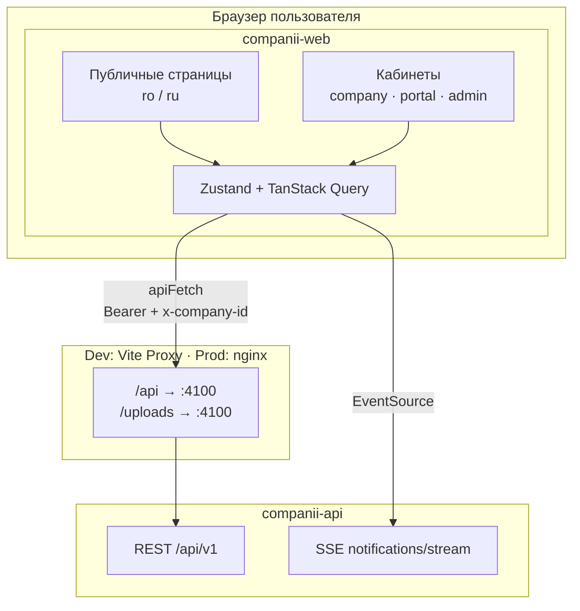

---

## Архитектура

Проект следует принципам **Feature-Sliced Design (FSD)** — код разделён по слоям ответственности, бизнес-логика живёт в `features/`.

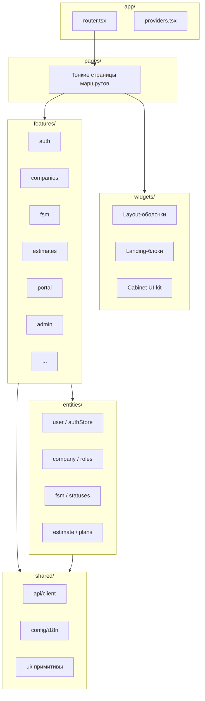

### Управление состоянием

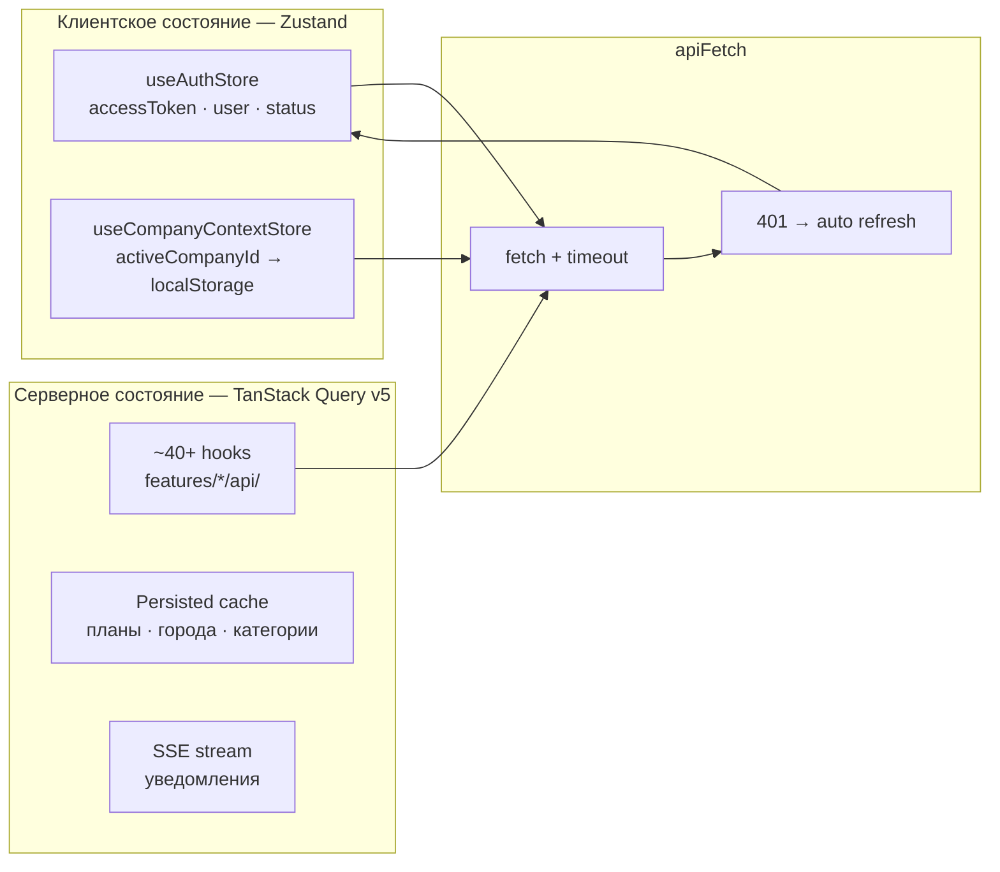

| Инструмент | Файл | Назначение |
|------------|------|------------|
| **Zustand** | `src/entities/user/model/authStore.ts` | Токен, пользователь, login/logout |
| **Zustand** | `src/entities/company/model/companyContextStore.ts` | Активная компания (persist) |
| **TanStack Query** | `src/shared/api/queryClient.ts` | Кэш API, staleTime 5 мин |
| **Persist** | `src/shared/api/persistQuery.ts` | IndexedDB для справочников |

> Redux **не используется** — осознанный выбор: Zustand для UI/auth, TanStack Query для всего серверного.

---

## Feature-модули

10 бизнес-модулей в `src/features/`:

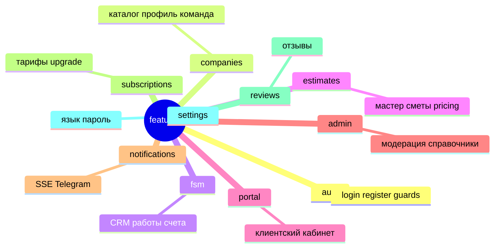

| Модуль | API-хуки | UI |
|--------|----------|-----|
| **auth** | `useAuth.ts` | формы login/register, `AuthBootstrap` |
| **companies** | `useCompaniesPublic`, `useCompaniesTeam` | профиль, галерея, каталог |
| **fsm** | `useCustomers`, `useLeads`, `useInterventions`, `useQuotes`, `useInvoices` | CRM, Kanban, календарь, аналитика |
| **estimates** | `useEstimateProjects`, `useEstimateActions` | мастер 5 шагов, worksheets |
| **portal** | `usePortal.ts` | секции заявок, смет, счетов |
| **admin** | `useAdminCompanies`, `useAdminStats` | модерация, blueprints |
| **notifications** | `api.ts` + SSE | `NotificationBell` |
| **subscriptions** | plans API | `PlanCards`, `PlanUpgradePanel` |

---

## Маршрутизация

Конфигурация: `src/app/routes/router.tsx`  
Константы: `src/shared/constants/routes.constants.ts`

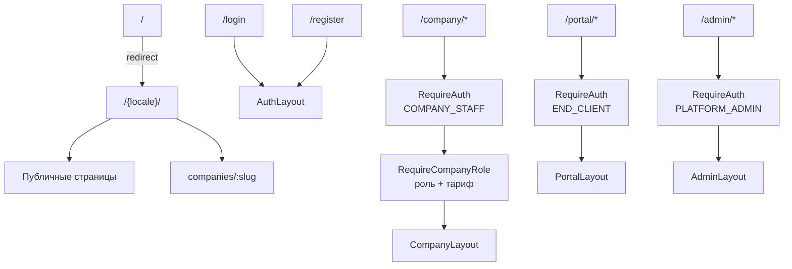

### Публичные страницы (`/{locale}/...`)

| Путь | Страница |
|------|----------|
| `/` | Лендинг |
| `how-it-works` | Как это работает |
| `faq` | FAQ |
| `preturi` | Тарифы |
| `companies` | Каталог компаний |
| `companies/:slug` | Профиль компании + заявка |
| `privacy`, `terms` | Юридические документы |

**Локали:** `ro` (по умолчанию) и `ru` — префикс в URL.

### Кабинет компании (`/company/*`)

| Путь | Раздел | Мин. роль / план |
|------|--------|------------------|
| `/company` | Dashboard + аналитика | MEMBER |
| `/company/profile` | Профиль компании | OWNER |
| `/company/clienti` | CRM клиентов | MANAGER · PRO |
| `/company/cereri` | Заявки (лиды) | MANAGER · PRO |
| `/company/pipeline` | Kanban | MANAGER · BUSINESS |
| `/company/lucrari` | Работы | MEMBER |
| `/company/calendar` | Календарь | MEMBER |
| `/company/smete` | Сметы | MANAGER · BUSINESS |
| `/company/oferte` | Оферты | MANAGER · BUSINESS |
| `/company/facturi` | Счета | MANAGER · BUSINESS |
| `/company/team` | Команда | OWNER |
| `/company/subscription` | Тариф | OWNER |
| `/company/audit` | Аудит | OWNER |

### Клиентский портал (`/portal/*`)

| Путь | Раздел |
|------|--------|
| `/portal` | Dashboard |
| `/portal/cereri` | Мои заявки |
| `/portal/lucrari` | Работы |
| `/portal/oferte` | Оферты (принять/отклонить) |
| `/portal/smete` | Сметы |
| `/portal/facturi` | Счета + подтверждение оплаты |

### Админка (`/admin/*`)

| Путь | Раздел |
|------|--------|
| `/admin` | Статистика + модерация |
| `/admin/companies` | Компании |
| `/admin/cities` | Города |
| `/admin/categories` | Категории |
| `/admin/blueprints` | Шаблоны смет |
| `/admin/waitlist` | Лист ожидания |
| `/admin/audit` | Аудит платформы |

Страницы загружаются **lazy** через `src/app/routes/lazy-pages/`.

---

## Роли и пользовательские сценарии

### Три типа аккаунтов

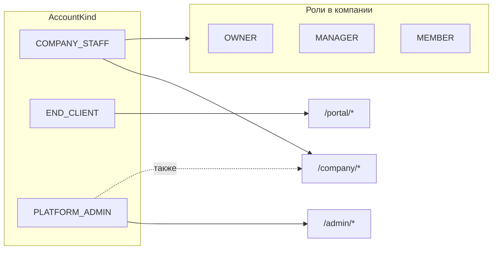

### Сценарий: от заявки до оплаты

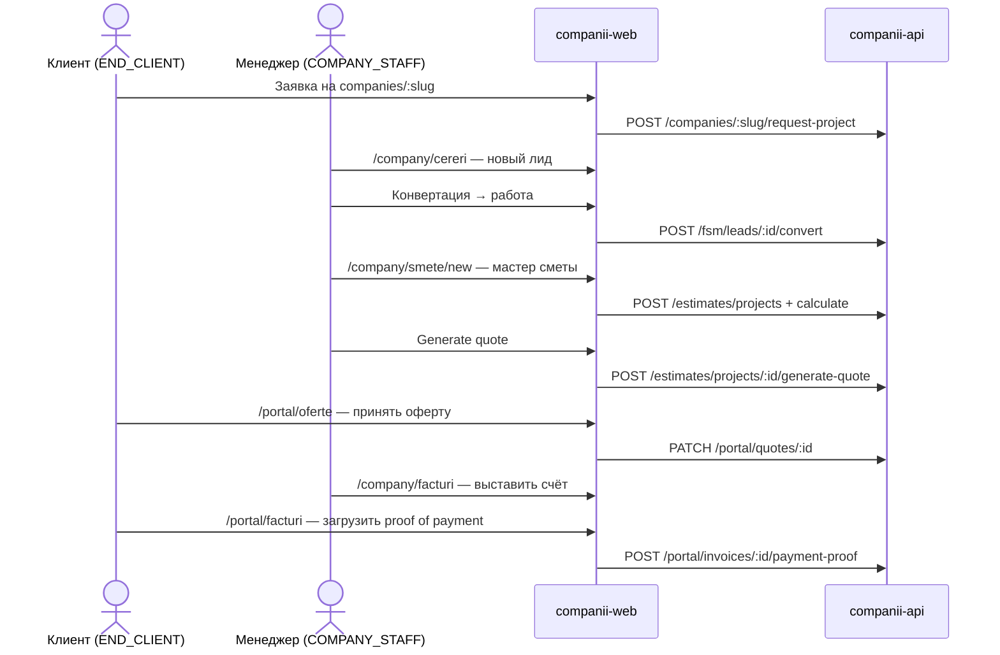

### Сценарий: сотрудник компании

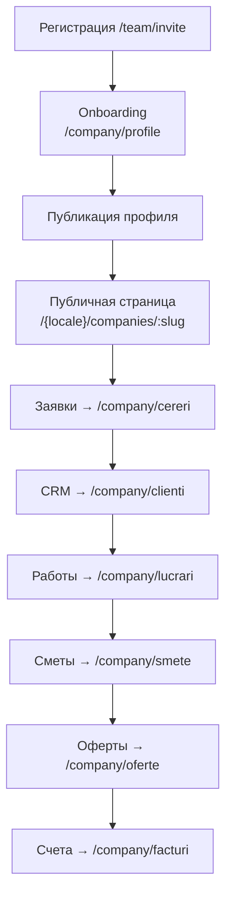

### Мастер сметы (5 шагов)

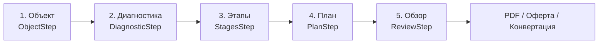

Файлы: `src/features/estimates/wizard/steps/`

---

## Взаимодействие с API

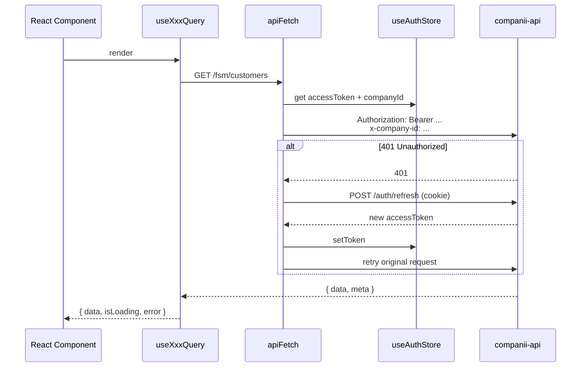

| Файл | Назначение |
|------|------------|
| `src/shared/api/client/apiFetch.ts` | Основной fetch-wrapper |
| `src/shared/api/client/config.ts` | Auth context + refresh |
| `src/entities/user/api/refreshAccessToken.ts` | Обновление токена |
| `src/entities/user/api/authContext.ts` | Bearer + x-company-id |
| `src/shared/config/env.ts` | `VITE_API_URL`, httpOnly cookie |

**Dev proxy** (`vite.config.ts`): `/api` и `/uploads` → `http://127.0.0.1:4100`  
**Prod** (`nginx.conf`): SPA fallback + proxy `/api/` → `http://api:4100/api/`

---

## UI и дизайн-система

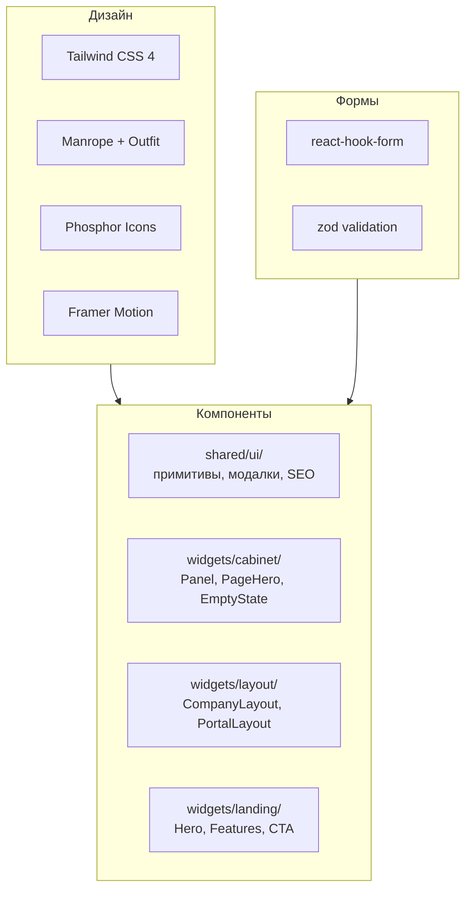

| Технология | Использование |
|------------|---------------|
| **Tailwind CSS 4** | `@theme` в `src/index.css`, violet/indigo палитра |
| **Radix UI** | Label, Slot |
| **TanStack Table** | Таблицы CRM, счетов |
| **ApexCharts** | Аналитика dashboard (lazy) |
| **react-hot-toast** | Уведомления |
| **react-helmet-async** | SEO meta tags |

Cabinet UI-kit: `src/widgets/cabinet/cabinet-ui.tsx` — `Panel`, `PageHero`, `SoftBadge`, glass-panel стили.

---

## Интернационализация (i18n)

| Параметр | Значение |
|----------|----------|
| Библиотека | i18next + react-i18next |
| Языки | `ro` (fallback), `ru` |
| Публичные URL | `/{locale}/...` |
| Кабинеты | Язык из localStorage / i18next |
| Lazy load | Только активный язык в initial bundle |

```
src/shared/config/i18n/translations/
├── companii/ru|ro/     # кабинет, auth, admin, portal
├── public/ru|ro/       # landing, marketing
└── status.ru|ro.ts     # статусы FSM
```

---

## Тарифные ограничения

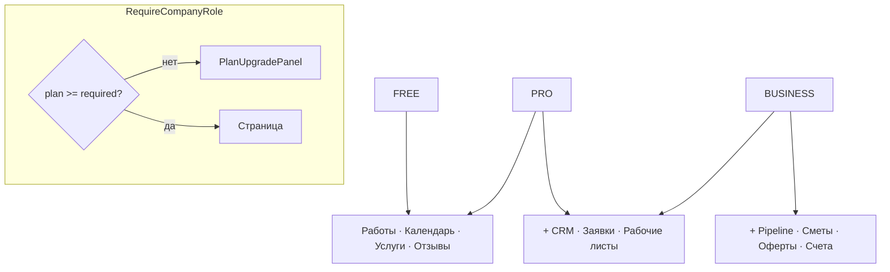

Файл: `src/entities/subscription/model/planEntitlements.ts`

---

## Быстрый старт

### Локальная разработка

```bash
# 1. Запустите API (в соседнем репозитории)
cd ../companii-api
docker compose -f docker-compose.dev.yml up -d postgres redis
npm run start:dev

# 2. Запустите фронтенд
cd ../companii-web
cp .env.example .env
npm install
npm run dev
```

| Сервис | URL |
|--------|-----|
| Приложение | http://localhost:5174 |
| API (через proxy) | http://localhost:5174/api/v1 |

### Docker

```bash
cp .env.docker.example .env.docker
npm run docker:up        # dev, порт 5174
npm run docker:prod:up   # prod nginx, порт 8082
```

---

## Переменные окружения

| Переменная | Описание | По умолчанию |
|------------|----------|--------------|
| `VITE_API_URL` | Base URL API | `/api/v1` |
| `VITE_DEV_API_PROXY_TARGET` | Target Vite proxy | `http://127.0.0.1:4100` |
| `VITE_ENV` | Окружение | `development` |
| `VITE_USE_HTTPONLY_COOKIE` | Refresh в cookie | `true` |
| `VITE_MEDIA_URL` | CDN для медиа (опц.) | — |

Production build args: `VITE_API_URL=https://api.companii.faber.md/api/v1`

---

## Структура репозитория

```
companii-web/
├── src/
│   ├── main.tsx
│   ├── app/
│   │   ├── providers.tsx       # Query, i18n, Motion
│   │   └── routes/             # router, lazy-pages, guards
│   ├── pages/                  # страницы маршрутов
│   ├── widgets/
│   │   ├── layout/             # CompanyLayout, PortalLayout, AdminLayout
│   │   ├── landing/            # лендинг-блоки
│   │   └── cabinet/            # UI-kit кабинета
│   ├── features/               # 10 бизнес-модулей
│   │   ├── auth/
│   │   ├── companies/
│   │   ├── fsm/
│   │   ├── estimates/          # самый крупный модуль
│   │   ├── portal/
│   │   └── admin/
│   ├── entities/               # доменные модели + stores
│   │   ├── user/model/authStore.ts
│   │   ├── company/model/roles.constants.ts
│   │   └── subscription/model/planEntitlements.ts
│   └── shared/
│       ├── api/                # apiFetch, queryClient
│       ├── config/i18n/        # переводы ro/ru
│       └── ui/                 # примитивы
├── nginx.conf                  # prod: SPA + API proxy
├── docker-compose.dev.yml
├── docker-compose.prod.yml
└── Dockerfile                  # dev (Vite) + prod (nginx)
```

---

## Скрипты

```bash
npm run dev              # Vite dev server :5174
npm run build            # tsc + vite build
npm run build:seo        # build + sitemap
npm run build:analyze    # bundle visualizer
npm run test             # Vitest
npm run lint             # ESLint
```

---

## Real-time уведомления

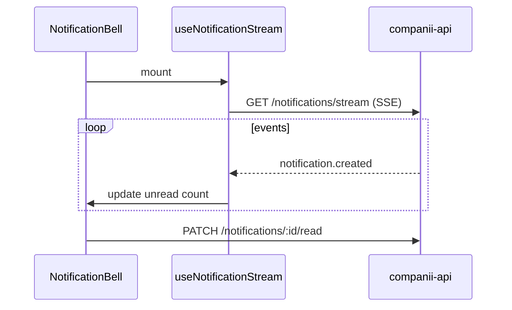

Файлы: `src/features/notifications/hooks/useNotificationStream.ts`

---

## Связь с API

| Аспект | Web | API |
|--------|-----|-----|
| Авторизация | Zustand + httpOnly cookie | JWT + refresh rotation |
| Tenant | `x-company-id` header | PostgreSQL RLS |
| Кэш | TanStack Query + IndexedDB | Redis cache |
| Файлы | `MediaImage`, lightbox | B2 / local uploads |
| PDF | download blob | BullMQ pdf workers |

Backend: **[companii-api](../companii-api)**

---

<div align="center">

**Faber Companii Web** · React 19 · Private

</div>
